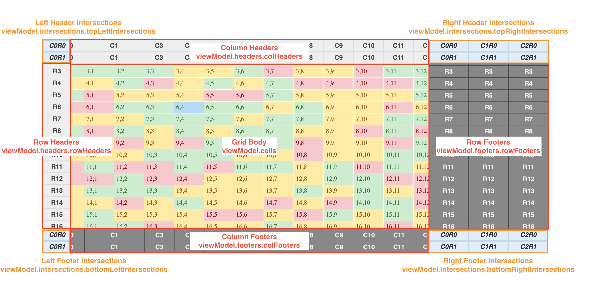

# Power Grid

## Features
* blazing fast performance and massive scale (100M cells+) via virtualized viewport
* React interface
* completely customizable cells via TSX (JSX) and CSS
* cell interactivity
* expand / collapse rows and columns
* merged cells support (colspans and rowspans)
* dynamic row heights and column widths
* native scroll bars
* any number of fixed rows and headers
* screen reader accessible via semantic table html

## React Cell TSX Example (MyCell)

```TSX
import React from 'react';
import styled from '@emotion/styled';
import { CellProps } from 'power-grid';

export type MyCellProps = CellProps<{
  rating: string;
  value: number;
}>;

const Cell = styled.div<{ rating: string; }>(({ rating }) => {
  let backgroundColor = '#eee';
  let color = '#333';
  switch (rating) {
    case 'bad':
      backgroundColor = '#ffc7ce';
      color = '#9c0006';
      break;
    case 'neutral':
      backgroundColor = '#ffeb9c';
      color = '#9c5700';
      break;
    case 'good':
      backgroundColor = '#c6efce';
      color = '#267c27';
      break;
  }
  return {
    backgroundColor,
    color,
    height: '100%',
    '&:hover': {
      backgroundColor: '#b0d9fe',
    },
  };
});

const MyCell: React.FC<MyCellProps> = (props: MyCellProps) => {
  const { viewModel } = props;

  return (
    <Cell rating={viewModel.rating}>
      {viewModel.value}
    </Cell>
  );
};

export default MyCell;
```

## View Model Example 

```javascript
let viewModel = {
  hideScrollbars: false,
  maxCellsWhileScrolling: 1000,
  x: 0,
  y: 0,
  colWidths: [100, 120],
  rowHeights: [80, 60],
  // row based.  array of rows, and each row is an array of cells
  cells: [
    [
      {
        renderer: MyCell,
        viewModel: {
          value: 5,
          rating: 'good'
        }
      },
      {
        renderer: MyCell,
        viewModel: {
          value: 5,
          rating: 'good'
        }
      }
    ],
    [
      {
        renderer: MyCell,
        viewModel: {
          value: 5,
          rating: 'good'
        }
      },
      {
        renderer: MyCell,
        viewModel: {
          value: 2,
          rating: 'bad'
        }
      }
    ]
  ]
}
```

## Usage App Example

```JSX
<PowerGrid
  width={200}
  height={100}
  viewModel={viewModel}
  onScroll={onScroll}
  onCellClick={onCellClick}
/>
```
## Grid Anatomy

